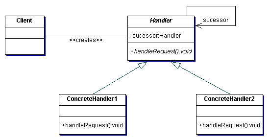

# Chain of Responsibility

The Chain of Responsibility pattern focuses on decoupling the sender of a request to its receiver by giving more than one object a chance to chandle the request. It does this by creating a chain of handlers to process a request. Each handler will determine if it needs to process the request and then hand it off to the next link in the chain through a successor property. The client code then only needs to track the start of the chain, and the chain manages itself.

## Example

Imagine we are implementing a compiler or interpretor for a language with exception handling like .NET, Java, JavaScript, Python, etc. As the implementor we know that try-catch blocks can be nested. We could write a class that tracks all the nested blocks using an array or other collection type to track the references. However that could create a lot of overhead tracking that state. It also would be brittle down the road as we begin to optimize our implementation.

Instead of tracking the entire state and its links we could use a Chain of Responsibility pattern. Each level of the nesting could correspond to a new handler. When we add new optimizations for exceptions I can simply create a new handler. We could design some handlers to short-circuit if we know at runtime those handlers are not necessary. Now all my implementation needs to track is the start of the chain, and the chain manages itself.

## Participants 

There are 3 participants in this pattern:

+ Handler - defines an interface for handling requests and optionally implementing the successor link.
+ ConcreteHandler - handles requests it is responsible for and forwards the request on to the successor if needed
+ Client - initiates the request to a ConcreteHandler object (beginning of the Chain)

## Why should I use it?

+ Ensure that objects are appropariately encapsulated and avoids tight couplings
+ Ensures objects can maintain a single responsibility (i.e. [Single Responsibility Principle](http://www.objectmentor.com/resources/articles/srp.pdf))
+ Improves maintainability through the flexibility of the system, i.e. since you can add new handlers, change existing handlers, or delete handlers within the existing chain to enhance functionality without breaking existing functionality (i.e. [Open/Closed Principle](http://www.objectmentor.com/resources/articles/ocp.pdf))
+ Chain of Responsibility is a pattern that helps avoid [Object Orgies](../../anti-patterns/object-orgy/README.md)

## When should I use it?

+ When more than one object can handle a request and the handler is not known a priori
+ You want a request to be handled by multiple objects but do not want to hard code those receivers (i.e. don't want to couple those receivers)
+ When the set of objects that should handle a request are determined dynamically

## Example Implementation

See [chain-of-responsibility.py](chain-of-responsibility.py)
