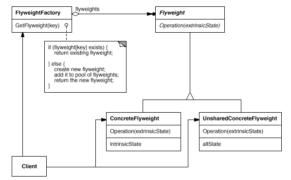

# Flyweight

The Flyweight pattern is used to support a large number of fine grained objects efficently.

## Example

Imagine we need to create a text processing application. We care very much about characters, words, and paragraphs. If we represented each character as an object that would give us a very fine grained flexibility in how we treat each of those characters (specifically for formatting). 

Well that sounds reasonable, but gaining that flexibility will cost us in performance. If we represent every character as an object we are going to end up with potentially millions of objects flying around causing memory concerns and performance issues.

We can use the Flyweight pattern to resolve this by sharing a core instrinsic objec that represents each letter, and then other objects can later add extrinsic information such as formatting if necessary. This gives us the same flexibility but without the cost. This is based on the fact that most letter 'a' for instance will not have formatting and thus we do not need to add any additional extrinsic state.

## Participants 

There are 5 participants in this pattern:

+ Flyweight - declares an interface through which flyweights can receive and act on extrinsic state
+ ConcreteFlyweight - implements the flyweight interface and shares intrinsic state independent of the context
+ UnsharedConcreteFlyweight - Necessary for any objects that do not require sharing intrinsic state
+ FlyweightFactory - creates and manages flyweights that ensures flyweights are properly shared
+ Client - maintains a reference to flyweights and stores the extrinsic state of flyweights

## Why should I use it?

+ Save time and performance complexity

## When should I use it?

+ Any application that uses a large number of objects
+ Storage costs high due to quantity of objects
+ Most object state can be made extrinsic
+ Many groups of objects can be replaced with relatively few shared objects
+ Application does not depend on object identity

## Example Implementation

+ See [flyweight.js](flyweight.js)
