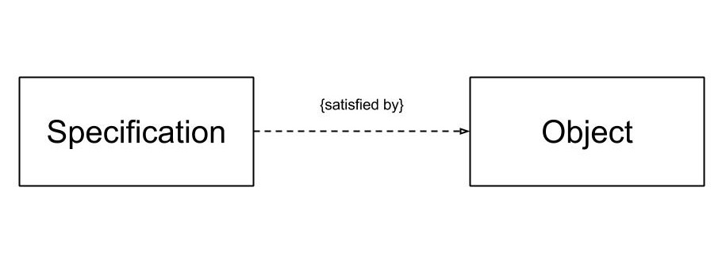

# Specification

The Specification pattern brings the power of Logic programming to OO programming. It builds on the notion of _predicates_ from Logic programming. A Specification is a _Value Object_ that can evaluate another object to see if the predicate is true for that object. It allows business logic to remain with the domain and provides a mechanism to build simple composable business rules that can be added, removed, and refactored with ease.

## Example

Imagine we are building a tshirt design application. We determine with the client that they have very complicated rules on what a design must have for it to be considered "printable". Each of those rules must be implemented and must be adhered too, but they only apply in certain contexts and are applied differently based on that context. You can see how this application could become extremely cumbersome with more than a few rules and more than a few contexts.

The Specification patterns allows us to build simple objects that represents each "printable" criteria. We can then compose those criteria together to build our different contexts. If a base rule changes we can be confident in the change because it is simple enough to keep in our heads. It can be unit tested, etc.

## Participants 

There are 2 participants in this pattern:

+ Specification - a simple _Value Object_ that returns a Boolean if the given object meets the criteria
+ Object - the given object that is being tested against the specification

## Why should I use it?

+ Ensures that business rules are self contained, small, composable, and testable
+ Makes sure that [God Objects](../../anti-patterns/god-object/README.md) are not created

## When should I use it?

+ Validate an object to see if it fulfills some need or is ready for some purpose
+ Select an object from a collection 
+ When you have business rules that can break down into small composable tests (may have to get creative)

## Example Implementation

See [specification.cs](specification.cs)
